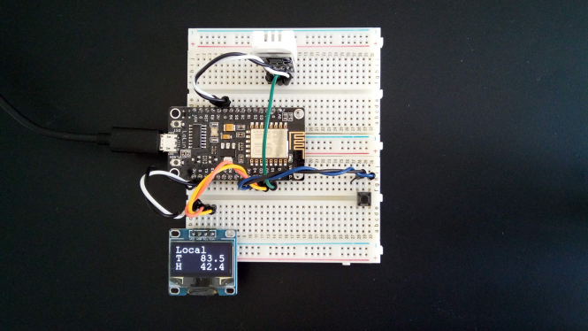

NodeMCU Weather Station is a simple project based on NodeMCU Lua ESP8266 CH340G
ESP-12E, but other ESP8266 modules should work. The idea is to start simple and add
functionality as hardware/software pieces are tested. I originally had a dedicated
weather station a friend got me for Christmas. It had an inside display and outside
probe for inside/outside temperature, humidity and basic weather. Any ways the outside
probe died, so it's time to build my own weather station.

### Goals
* Acquire inside temperature and humidity
* Acquire outside basic weather
* Display information as a series of screens automatically
* Switch to turn display on/off (or other stuff)

### Features
* Stand alone weather station that can run off battery or AC power
* Inside temperature and humidity
* Outside weather using api.openweathermap.org REST service
* NTP time sync
* Sequential screen flow (add your own screens)
* Turn display off when not in use
* Centralized configuration using config.lua

### Future
* Remote weather sensors using another NodeMCU
* Bigger display
* Use MQTT to get/send weather data
* Store data with timestamp when wifi is offline

### Parts
This is the official parts list, but you can substitute or add parts as needed.
* NodeMCU Lua ESP8266 CH340G ESP-12E
* DHT11, DHT22 or AM2302 sensor (I used the AM2302)
* SSD1306 display (I used the I2C version)
* Micro Momentary Tactile Push Button Switch
* Two mini breadboards (NodeMCU is too big for single breadboard)
* 9 male to male jumper wires (11 wires if you want to power everything off breadboard power rail) 
* Micro USB cable to power off PC during development

### Configure and test NodeMCU
I have been using [ESPlorer](https://esp8266.ru/esplorer) with an Ubuntu 18.04 VM,
but you should be able to use another OS including Windows. I'm using the floating
point image produced from NodeMCU custom builds site.
* Follow the [Run NodeMCU on ESP8266 LoLin V3](https://github.com/sgjava/nodemcu-lolin)
directions. In the NodeMCU custom builds site:
* Select the master branch
* Select the following modules: dht,file,gpio,http,i2c,net,node,rtctime,sjson,sntp,tmr,u8g,uart,wifi,tls
* Select font_courR18 font

### Open Weather Map
This project uses the Open Weather Map API, so it’s necessary to sign up on
their platform and obtain an API key. OpenWeatherMap’s free plan provides
everything you need for this project. To use the API you need an API key
known as the APIID:
* Open a browser and go to [Open Weather Map](https://openweathermap.org)
* Press the Sign up button and create a free account
* Once your account is created, you’ll be presented with a dashboard that contains several tabs
* Select the API Keys tab and copy the key to config.lua

### Add components

I powered everything off the NodeMCU for simplicity. I also have powered
everything off the breadboard power rail. Feel free to wire it up any way
you want though. If you use different GPIO pins then update config.lua. If
you want to wire it exactly as the picture above then look at current
config.lua:
* D1 AM2302
* D2 SSD1306 SDA
* D3 SSD1306 SCL
* D4 Button (note only top two pins are used)
* All three 3V/G pins are used for power

### Load Lua files
Using ESPlorer I open all the source files and use Save to ESP button in this order:

* config.lua
* wifi_connect.lua
* display.lua
* main.lua (this will crash the first time it runs because init.lua sets up display)
* init.lua

If you are lucky and everything is wired and configured correctly then you should
have a working weather station. 